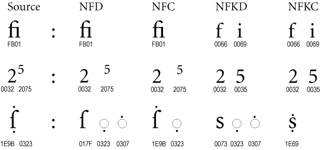

# BIG data
Please read each section to understand how each file type is used and created.

## <dictionary_type>_dictionary.json
- gene_chin_dictionary.json
- stephen_li_dictionary.json

These files are the actual dictionaries databases converted into a JSON format. The json file does not need to be in a special format, but the dictionary's class must be implemented so that it converts the file into a standardized python dict structure.

See `stephenli_dictionary.py`, and notice how the `load_dictionary` fn overides the `DictionaryBase` implementation, which just loads the json file as is.

Each Dictionary Class is a singleton and is instantiated when you import the module.

## <romanization_system>_table.csv
- hsr_jyutping_table.csv
- sl_jyutping_table.csv
- gc_jyutping_table.csv
- dj_jyutping_table.csv
- jw_jyutping_table.csv

These files are taken from the sheets in `raw/Initial_Finals_Converter.xlsx`. They are read when the  singleton `class JyutpingTables` is imported. The csv file paths for each romanization table are configured in `config.json`

## tones.json
This file is taken from the spreadsheet `raw/Initial_Finals_Converter.xlsx`. Tone information is stored in cells `V1`-`AN1` in the spreadsheet, and is converted to a dict format in `tones.json`.

It is important to note that for **Gene Chin** the tone format is complicated, involving *diacritic* marks. Programatically, we use Unicode combining characters to add these marks onto the letters, see more details in the [Unicode Diacritic Marks](#unicode-diacritic-marks) section below.

In addition, Gene Chin (GC) jyutping system can have a slash indicating a rising tone at the end of the word.

All romanization sytems have their tones stored as a **key, string_value pair** such as `LOW_RISE`: `"225"`, except *GC* tones, which can **also** be stored as a tuple, as demonstrated below:
 1. `LOW_FLAT`: `["\u0302"]`
 2. `LOW_RISE`: `["\u0302", "/"]`
 3. `RARE1`: `"552"` - the same format as other romanization systems

## Unicode Diacritic Marks
In Unicode, there may be many ways to represent a letter with a special mark. This is where Unicode normalization comes in. Normalization standardizes how a special letter is represented in unicode characters, and allows us to string operations on the string.

For GC romanization, we store the diacritic mark in NFD form, which means the combining character (diacritic) is stored as a separate character.

When constructing a GC romanization, we add the combining ch **after** the first letter of the *final*.

#### Example - **chẽim**
Initial: **ch** \
Final: **eim** \
Tone: **LOW_FLAT** \
Construction: `ch` + `e` + `\u0343` + `im`
